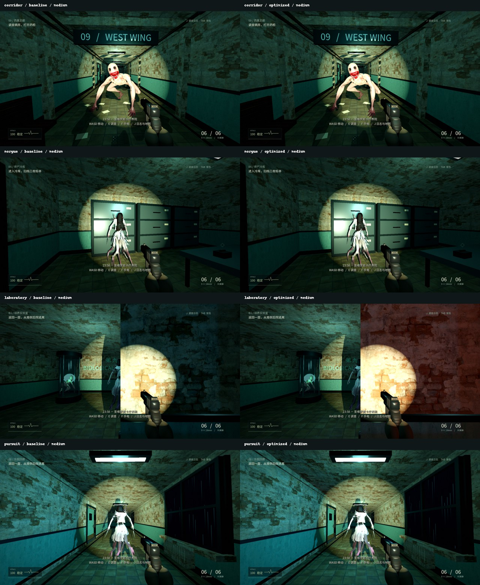
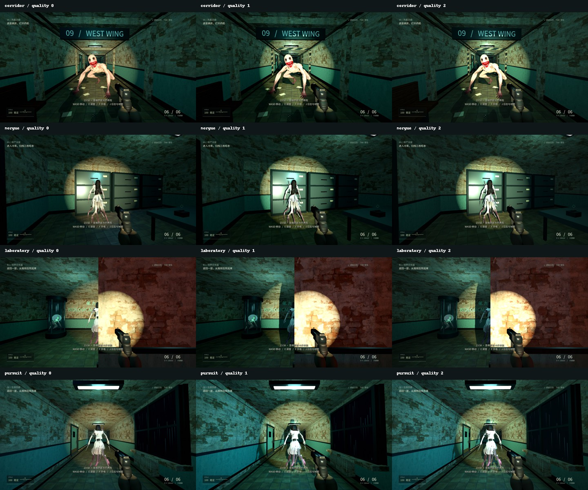

# 网页性能优化验证 · 2026-09-08

本轮仅修改独立网页版。网页导出已完成，未发布公网。**Chrome/Edge 实测验收尚未完成**：Chrome 控制调用返回 `unsupported Codex auth method: apikey`，重试仍失败。未采用其他浏览器或脚本绕过连接限制。下表为独立网页版工程的原生 Compatibility 渲染参考，不能当作 WebAssembly / WebGL 的性能结论。

## 已交付行为

- 画布内部像素按比例限制在 1920×1080 内，CSS 仍铺满窗口。响应窗口、全屏、DPR/显示器切换，尺寸不变时不重设画布。三维渲染比例仍为低 0.65、中 0.82、高 1.0。
- 全场景及手电总阴影数量为低 0、中 3、高 4；中高档保留方向光和手电，附近原有投影聚光灯分别保留 1 / 2 盏。其他灯的照明颜色和能量保留。
- 每 0.5 秒选择附近聚光灯，新灯至少近 2 米才替换，避免在房间交界反复切换。
- 尘埃每秒最多上传 20 次位置，运动使用累计活动时间。暂停、失焦及后台停止更新；普通游玩不再采样或发送性能诊断。
- 新增 `?qa=benchmark&quality=1`（quality 可取 0 / 1 / 2，默认中）。每场景预热 5 秒、采样 30 秒、重复三次，约 7 分钟。使用实际渲染帧之间的单调时钟间隔，不使用 `--fixed-fps`。
- 页面报告含画布/CSS 尺寸、DPR、浏览器标识、启动资源及游戏就绪时间、帧时间中位数/P95、超过 50ms 的帧数、绘制调用数。采样时失焦、进入后台、调整窗口或 DPR 会标记结果无效。报告的 passed 表示采样完成，不代表达到性能目标。

## 渲染参考数据

同机 RTX 3080 Ti、Godot 4.7.1、原生 OpenGL Compatibility、1920×1080、中画质。下表 P95 为三次结果的中位数。保留 VSync 配置，模拟与动画仍运行，固定相机。原始样本见 [优化前](baseline_native.json)、[优化后](optimized_native.json)、[汇总与重复波动](comparison.json)。

| 场景 | 优化前 P95 | 优化后 P95 | 降低 | 绘制调用数（前 → 后） |
| --- | ---: | ---: | ---: | ---: |
| 走廊 | 12.025 ms | 9.721 ms | 19.16% | 2791 → 2277 |
| 停尸间 | 14.487 ms | 11.270 ms | 22.21% | 3041 → 2872 |
| 实验室 | 8.034 ms | 6.298 ms | 21.61% | 1723 → 1267 |
| 追逐走廊 | 8.475 ms | 6.664 ms | 21.37% | 1750 → 1343 |

两个版本全部 24 段采样均无超过 50ms 的帧。没有观察到场景 P95 退步；停尸间重复采样存在波动。采样期间执行了部分开发/无界面回归，未隔离系统后台负载。这组数据支持阴影调整减少渲染开销，但不覆盖浏览器、页面分辨率上限的实际收益、鼠标手感或首次浏览器加载。**浏览器 P95 降低 20% 的目标未验收。**

## 功能及画面检查

| 检查 | 结果 |
| --- | --- |
| 既有集成回归 | 55 / 55，含存档、恢复、门、谜题、命中、暂停、重试 |
| 怪物回归 | 52 / 52，含骨骼命中、攻击、死亡、旧记录兼容 |
| 常规通关 | 通过，4 次射击、生命 100、模拟活动时间 130.78 秒 |
| 零弹药通关 | 通过，0 次射击、生命 76、模拟活动时间 97.22 秒 |
| 新增引擎画质回归 | 29 / 29，使用实际渲染器；含三档往返、阴影预算/滞后、尘埃限频、暂停/后台/恢复、普通模式不采样 |
| 网页外壳回归 | 5 / 5，Node 最小 DOM 环境；含高分屏/超宽/全屏事件/DPR、零尺寸、采样参数及无效标记 |
| 网页交付检查 | 9 个资源 HTTP 200、gzip/MIME、构建尺寸与部署 ZIP 字节一致，见 delivery_checks.json |
| 原生画面检查 | 优化前中画质 4 张、优化后三档共 12 张；已检查拼图 |
| Chrome/Edge 真实窗口、鼠标、全屏与持久化 | 待验证，外壳模拟测试不能代替此项 |
| 首次浏览器加载对比 | 待验证，已提供计时字段 |

中画质走廊、停尸间及追逐场景主要外观保留。实验室关闭部分全向光阴影后，局部墙面出现更多红色照明；手电阴影和房间结构仍保留。拼图仅用于原生渲染的外观对照，不证明浏览器画面完全一致。





原始全尺寸截图与临时日志保存在项目 `.runtime/web-performance/`。此前无界面尘埃检查无法读取实例变换，改用实际渲染器后通过；`Test_Web.ps1 -Rendered` 使用正确的检查方式。

## 复现

从项目根目录运行：

```powershell
./WebVersion/Test_Web.ps1 -Rendered
./WebVersion/Build_Web.ps1
python WebVersion/tools/serve.py --port 9089
```

首次诊断版导出在优化前保存于 `.runtime/web-performance/baseline-site/`，包含相同采样入口；它是本机生成物，不随 Git 分发。可以在另一个终端启动：

```powershell
python WebVersion/tools/serve.py --port 9090 --directory .runtime/web-performance/baseline-site
```

依次在同一个独立 Chrome/Edge 窗口打开 `http://127.0.0.1:9090/?qa=benchmark&quality=1` 和 `http://127.0.0.1:9089/?qa=benchmark&quality=1`，点击「进入雨夜」。测试时保持相同窗口大小、DPR 和硬件加速状态，停留前台，不并行跑两个游戏。完成后保存页面底部 JSON；只有 `valid: true` 的报告可参与对比。第一次与后续缓存启动须分别记录。

测试使用 `test_progress.json`，不覆盖 `progress.json`；benchmark 画质只改当前运行内存，不保存设置。正常版本仍使用原有存档与画质偏好。低、高档按同样方式修改 quality 参数。首次加载不是本轮原生测量所涵盖的指标。

若浏览器主要卡顿场景 P95 尚未降低 20%，继续用该入口定位，不能仅凭平均 FPS 或原生数据宣称目标已达成。
